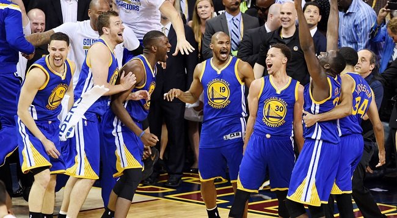
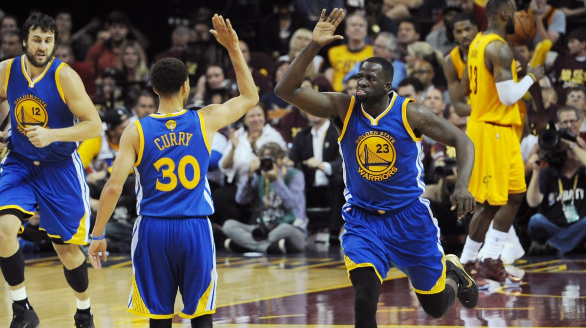
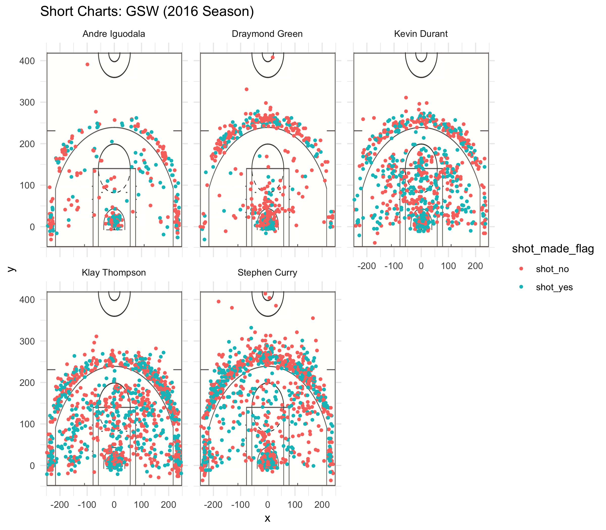
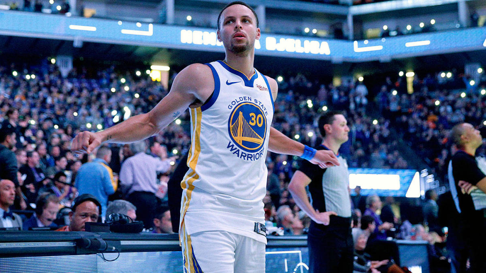

workout01-aditya-yadav
================

### Import Libraries

``` r
library(dplyr)
```

    ## 
    ## Attaching package: 'dplyr'

    ## The following objects are masked from 'package:stats':
    ## 
    ##     filter, lag

    ## The following objects are masked from 'package:base':
    ## 
    ##     intersect, setdiff, setequal, union

### Fetch Data:

``` r
data <- read.csv("../data/shots-data.csv")
```

### 2PT Effective Shooting % by Player (Calculation)

``` r
#2pt effective shooting % by player:
curry_shots <- (data[data$shot_type=="2PT Field Goal" & data$name=="Stephen Curry",])
green_shots <- (data[data$shot_type=="2PT Field Goal" & data$name=="Draymond Green",])
iguodala_shots <- (data[data$shot_type=="2PT Field Goal" & data$name=="Andre Iguodala",])
thompson_shots <- (data[data$shot_type=="2PT Field Goal" & data$name=="Klay Thompson",])
durant_shots <- (data[data$shot_type=="2PT Field Goal" & data$name=="Kevin Durant",])

names <- c("Stephen Curry", "Draymond Green", "Andre Iguodala",
           "Klay Thompson", "Kevin Durant")
shots_taken <- c(nrow(curry_shots), nrow(green_shots),
                 nrow(iguodala_shots), nrow(thompson_shots),
                 nrow(durant_shots))
shots_made <- c(nrow(curry_shots[curry_shots$shot_made_flag=="shot_yes",]),
                nrow(green_shots[green_shots$shot_made_flag=="shot_yes",]),
                nrow(iguodala_shots[iguodala_shots$shot_made_flag=="shot_yes",]),
                nrow(thompson_shots[thompson_shots$shot_made_flag=="shot_yes",]),
                nrow(durant_shots[durant_shots$shot_made_flag=="shot_yes",]))

#2PT Effective Shooting % by Player
df_2pt_perc <- arrange(data.frame("name"=names, "total"=shots_taken, "made"=shots_made, "perc_made"=shots_made/shots_taken), desc(perc_made))
```

### 3PT Effective Shooting % by Player (Calculation)

``` r
#3PT Effective Shooting % by Player
curry_shots <- (data[data$shot_type=="3PT Field Goal" & data$name=="Stephen Curry",])
green_shots <- (data[data$shot_type=="3PT Field Goal" & data$name=="Draymond Green",])
iguodala_shots <- (data[data$shot_type=="3PT Field Goal" & data$name=="Andre Iguodala",])
thompson_shots <- (data[data$shot_type=="3PT Field Goal" & data$name=="Klay Thompson",])
durant_shots <- (data[data$shot_type=="3PT Field Goal" & data$name=="Kevin Durant",])

shots_taken <- c(nrow(curry_shots), nrow(green_shots),
                 nrow(iguodala_shots), nrow(thompson_shots),
                 nrow(durant_shots))
shots_made <- c(nrow(curry_shots[curry_shots$shot_made_flag=="shot_yes",]),
                nrow(green_shots[green_shots$shot_made_flag=="shot_yes",]),
                nrow(iguodala_shots[iguodala_shots$shot_made_flag=="shot_yes",]),
                nrow(thompson_shots[thompson_shots$shot_made_flag=="shot_yes",]),
                nrow(durant_shots[durant_shots$shot_made_flag=="shot_yes",]))

#3PT Effective Shooting % by Player
df_3pt_perc <- arrange(data.frame("name"=names, "total"=shots_taken, "made"=shots_made, "perc_made"=shots_made/shots_taken), desc(perc_made))
```

### Effective Shooting % by Player (Calculation)

``` r
new_total <- df_2pt_perc$total + df_3pt_perc$total
new_made <- df_2pt_perc$made + df_3pt_perc$made
new_perc <- new_made / new_total
df_all_perc <- arrange(data.frame("name"=names, "total"=new_total, "made"=new_made, "perc_made"=new_perc), desc(perc_made))
```

<br>
<hr>
<hr>
<center>
Narrative Below
</center>
<hr>
<hr>
<br>

The Warriors Continue to Make NBA History
-----------------------------------------



#### *Utter Dominance*

The Golden State Warriors have been one of, if not the most, dominant teams in the NBA.

Their field goal percentage, **58.5%** is the highest mark in NBA History. They’ve won the most regular-seasons games of all time, setting the bar at a ridiculous **73 games.** They broke a **40 year** title drought.

#### Motivation:

What is it that has actually separated this team so much from all the others? Why are they doing so well? We believe the answer comes down to this team’s ridiculous ability to shoot a basketball.

#### Analysis:

As mentioned earlier, the Warriors have the highest field goal percentage in NBA history. They’re also on their way to becoming the fourth team in the last 20 years to make half their shots. And on top of that, they also average a greater PPS (Point Per Shot) than any other team in the NBA, both during the regular season and playoffs.

However, if you actually analyze the Warriors play style and shot selection, you see that **they don’t play like modern teams.** The game of Basketball has changed and nowadays, almost every team avoids mid-range shots. Surprisingly, the Warriors lead the NBA in that department, and also have the highest PPS in that regard as well.

The main reason behind this is the fact that the Warriors have some of the best shooters in the entire NBA on their roster. Golden State has repeatedly been called one of the most talented teams to ever grace the NBA. That all comes from likes of **Stephen Curry, Klay Thompson, Draymond Green, Kevin Durant, and Andre Iguodala.** They lead the NBA and boast ridiculous shooting stats that blatantly prove why the Warriors are ahead in all these various regards. Analyzing each player individually just shows the crazy consistency, in not just one of these players, but all of them.

#### Data:

If we take a look at each of their shot charts from the 2016 seasons, it’s easily evident that all five of these players are talented from all regions of the court:



Each one of them has such a variety of shot selections, and it looks as if almost half their shots are actually made. *The data is sparse for Andre Iguodala, yet he still ranks up there with these other four.* Stephen Curry is definitely at the forefront among these various players. He has been called the greatest player of all time by numerous analysts, and has set crazy records himself throughout his time at Golden State. Many claim he is the real reason behind the success of Golden State. However the combined subset of players mentioned earlier is the real reason.

To further prove the ridiculous shooting ability of these players, we can take a look at their shooting percentages from various parts of the court:

<br>
<hr>
**2pt Effective Shooting Percentage:**

``` r
df_2pt_perc
```

    ##             name total made perc_made
    ## 1 Andre Iguodala   210  134 0.6380952
    ## 2   Kevin Durant   643  390 0.6065319
    ## 3  Stephen Curry   563  304 0.5399645
    ## 4  Klay Thompson   640  329 0.5140625
    ## 5 Draymond Green   346  171 0.4942197

From this table we can see that almost every one of these players makes **50+%** of their 2 point shots. 2 actually make **60+%** with the highest being Andre Iguodala at **63%.** That’s a ridiculous number and clearly shows the power Golden State has either in the paint or from 2pt range. Other teams don’t shoot as many mid-range shots as Golden State, however if those teams had players like this, we just might see that change as well.

<hr>
**3pt Effective Shooting Percentage:**

``` r
df_3pt_perc
```

    ##             name total made perc_made
    ## 1  Klay Thompson   580  246 0.4241379
    ## 2  Stephen Curry   687  280 0.4075691
    ## 3   Kevin Durant   272  105 0.3860294
    ## 4 Andre Iguodala   161   58 0.3602484
    ## 5 Draymond Green   232   74 0.3189655

Looking at the 3 point effective shooting percentage, we can see how talented these top players are from far as well. The top players like Stephen Curry and Klay Thompson make around **40%** of their 3 point shots. The rest have pretty high numbers as well. It is definitely unusual to see such high numbers among not 1, or 2, but by around 4-5 different players on the same team.

<hr>
**Total Effective Shooting Percentage:**

``` r
df_all_perc
```

    ##             name total made perc_made
    ## 1 Draymond Green  1330  670 0.5037594
    ## 2 Andre Iguodala   835  409 0.4898204
    ## 3  Klay Thompson   801  387 0.4831461
    ## 4  Stephen Curry   790  380 0.4810127
    ## 5   Kevin Durant   578  245 0.4238754

Finally, the table that really drives the crazy talent of these players home is this one. When we first saw it we were definitely shocked. On one single team, there are 4-5 players that are **making around 50% of all the shots they take.** That is absolutely ridiculous. That alone is enough to make people question whether or not such a team is even beatable. If any one of these players has a rough day, the impact on the team is nowhere near as much as it would be if Lebron couldn’t play for a game. That added confidence and reliance in teammates probably leads to more success within the team as well, creating a positive feedback loop. It makes sense that we probably won’t see such a talented roster again for a long time in the NBA. Typically it has not been the case that so many players on one single team are so talented, that it skews the balance of the entire NBA.
<hr>
<br>

#### Further Discusison:

The Warriors are definitely not a team to take lightly. People who don’t really follow Basketball know of Golden State because of their ridiculous seasons as of late. The team has broken and continues to break more and more records as the years go on. Not just the team, but each of their top players is breaking records as well. We are witnessing a major moment in NBA history, and possibly one of the best teams of all time. Their shooting percentages are absolutely ridiculous and only seem to get better. There is a paradox in their game, where they seem to be one of the only teams that goes for those mid-range jumpers. Yet with such a talented team, that’s definitely the right call. In a lot of ways, perhaps being unorthodox in that regard is actually a really good thing. If teams don’t expect that, they won’t prepare for it. And as a result, they won’t know how to stop Golden State. It’ll be very interesting now to see if Golden State can continue their dominance and this level of play. Can Steph Curry, Klay Thompson, Kevin Durant, Andre Iguodala, and Draymond Green all maintain their level of play for the years to come? Do they all actually need to? Questions have been posed asking whether Golden State would still be a competitive team if they lost 2 or even 3 of these specific players. All of that is hypothetical for now, but perhaps we will actually see this occur in the future. All that being said, Golden State is a force to be reckoned with right now and the other teams in the NBA know that they can’t sit there hoping the Warriors fall off the scene. Because from what we have seen, that is far from happening.



#### Take home message:

Golden State has made, and continues to make NBA history, as a result of having one of the most **talented set of shooters to ever be in the NBA.**

<br>

#### References:

-   <http://www.nba.com/article/2017/12/14/one-team-one-stat-warriors-shooting-better-ever>
-   <https://shottracker.com/articles/are-the-warriors-making-the-mid-range-relevant-again>
-   <https://bleacherreport.com/articles/2749739-5-wild-stats-defining-golden-state-warriors-season#slide4>
-   <https://www.goldenstateofmind.com/2018/2/21/17010344/2018-nba-golden-state-warriors-steph-curry-efficiency-deep-threes-layups>

-   <http://ramblingeveron.com/2016/03/15/are-the-2016-golden-state-warriors-the-greatest-nba-team-of-all-time/>
-   <http://ramblingeveron.com/wp-content/uploads/2016/03/warriors.jpg>

-   <https://sportshub.cbsistatic.com/i/r/2019/02/25/79af56f7-0f90-4e0c-83a6-ed26a6957468/thumbnail/1200x675/52127cfa1d6b87b607e44bb18b8f5440/stephen-curry-warriors.jpg>
